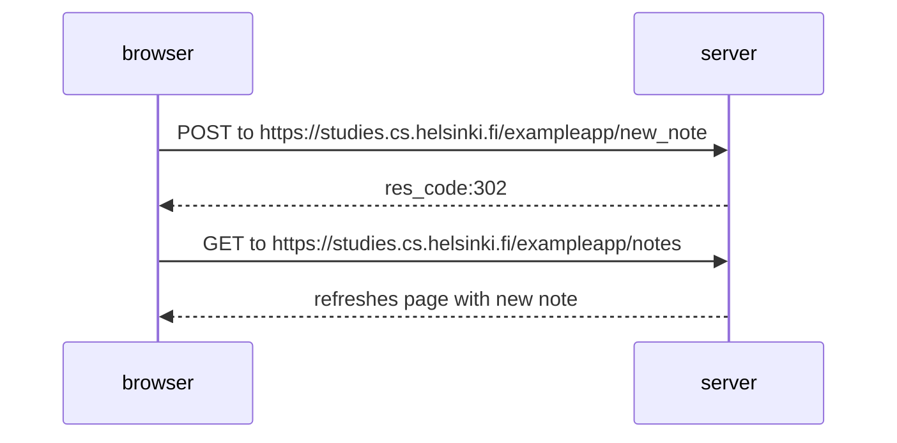

A chart showing what happens after user submits note

```mermaid
sequenceDiagram
	browser->>server: POST to https://studies.cs.helsinki.fi/exampleapp/new_note
	server-->>browser: res_code:302 
	browser->>server: GET to https://studies.cs.helsinki.fi/exampleapp/notes
	server-->>browser: refreshes page with new note
```