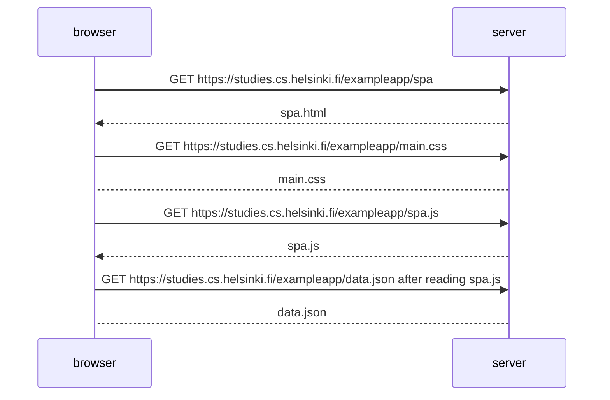

Single Page application:

```mermaid
sequenceDiagram
	browser->>server: GET https://studies.cs.helsinki.fi/exampleapp/spa
	server-->>browser: spa.html
	browser->>server:GET https://studies.cs.helsinki.fi/exampleapp/main.css
	server-->browser: main.css
	browser->>server: GET https://studies.cs.helsinki.fi/exampleapp/spa.js
	server-->>browser: spa.js
	browser->>server: GET https://studies.cs.helsinki.fi/exampleapp/data.json after reading spa.js
	server-->browser: data.json
```